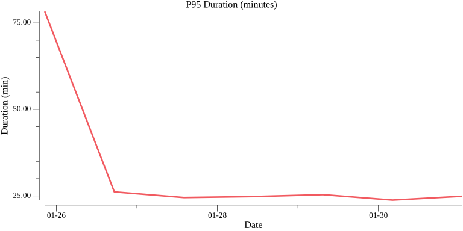
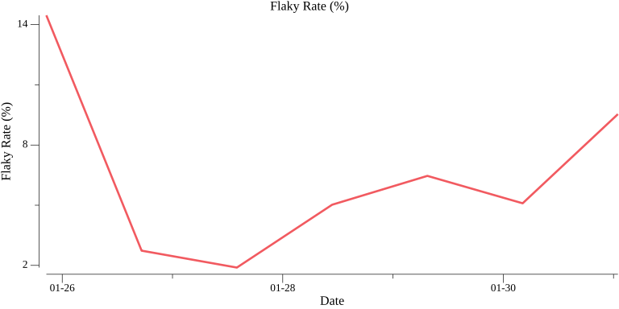
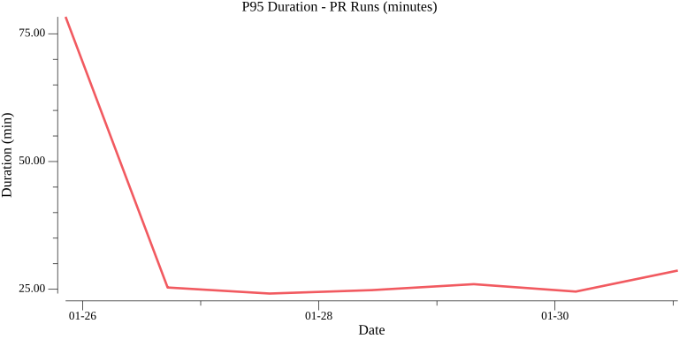
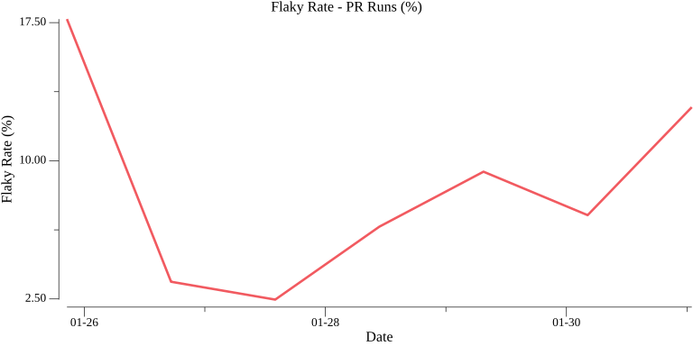

# Week 5 of 2026

**Period:** 2026-01-26 to 2026-02-01
**Generated:** 2026-02-12 18:19:37

## Summary

- **Total runs**: 9860
- **Success rate**: 66.2%
- **Flaky rate**: 5.1%
- **Average duration**: 15.3 min
- **P95 duration**: 25.0 min

## End-User Experience (Pull Request Runs)

Metrics for PR-triggered workflow runs - this represents the experience developers have when submitting pull requests.

- **PR-triggered runs**: 7010 (71.1% of total)
- **Success rate**: 65.0%
- **Flaky rate**: 6.8%
- **Average duration**: 19.7 min
- **P95 duration**: 25.2 min

## Daily Trends

### Overall Metrics (All Runs)

#### P95 Latency Over Time (minutes)

#### Flaky Rate Over Time (%)

### End-User Experience (PR-Triggered Runs)

#### P95 Latency Over Time - PR Runs (minutes)

#### Flaky Rate Over Time - PR Runs (%)

## Per-Workflow Analysis

Breakdown by individual workflow to identify improvement opportunities.

### Top 10 Workflows by Run Count

| Rank | Workflow | Total Runs | Success Rate | Flaky Rate | Avg Duration (min) | P95 Duration (min) |
|------|----------|------------|--------------|------------|--------------------|--------------------|
| 1 | check-milestone-label | 927 | 39.1% | 5.7% | 56.8 | 4.8 |
| 2 | Issue and PR comment commands | 923 | 99.8% | 0.0% | 0.5 | 1.3 |
| 3 | Retry workflow | 843 | 28.6% | 0.0% | 0.1 | 0.1 |
| 4 | Tests | 808 | 73.5% | 2.2% | 13.9 | 17.5 |
| 5 | Conformance tests | 804 | 39.2% | 34.1% | 24.2 | 67.3 |
| 6 | Verify codegen | 662 | 62.5% | 2.6% | 15.4 | 22.2 |
| 7 | cli | 662 | 74.2% | 2.9% | 13.2 | 9.8 |
| 8 | Lint | 662 | 66.0% | 2.6% | 11.8 | 7.7 |
| 9 | Build images | 662 | 76.6% | 2.6% | 11.1 | 6.7 |
| 10 | Check actions | 662 | 86.4% | 2.6% | 7.0 | 1.2 |

## Daily Breakdown

| Date | Total Runs | Success Rate | Flaky Rate | Avg Duration (min) | P95 Duration (min) |
|------|------------|--------------|------------|--------------------|--------------------|
| 2026-01-26 | 159 | 69.2% | 14.5% | 22.1 | 78.3 |
| 2026-01-27 | 1683 | 67.9% | 2.7% | 8.0 | 26.2 |
| 2026-01-28 | 1322 | 66.3% | 1.9% | 8.5 | 24.6 |
| 2026-01-29 | 2309 | 63.4% | 5.0% | 15.3 | 24.8 |
| 2026-01-30 | 2275 | 68.7% | 6.5% | 6.9 | 25.4 |
| 2026-01-31 | 1158 | 66.8% | 5.1% | 36.3 | 23.8 |
| 2026-02-01 | 954 | 62.9% | 9.5% | 31.4 | 24.9 |

## Top 5 Most Flaky Workflows

1. **Conformance tests** - 34.1% flaky (804 runs)
2. **Dummy** - 18.5% flaky (27 runs)
3. **releaser** - 16.7% flaky (6 runs)
4. **Build devcontainer** - 7.6% flaky (659 runs)
5. **helm-release** - 6.7% flaky (15 runs)

## Top 5 Slowest Workflows (P95)

1. **releaser** - 379.9 min P95 (6 runs)
2. **Conformance tests** - 67.3 min P95 (804 runs)
3. **Load Tests** - 35.9 min P95 (531 runs)
4. **Publish images** - 27.8 min P95 (146 runs)
5. **Verify codegen** - 22.2 min P95 (662 runs)
