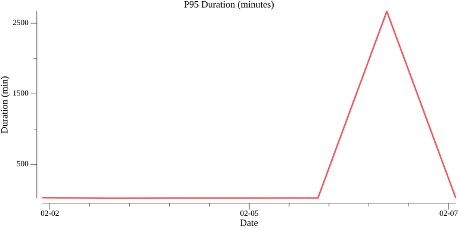
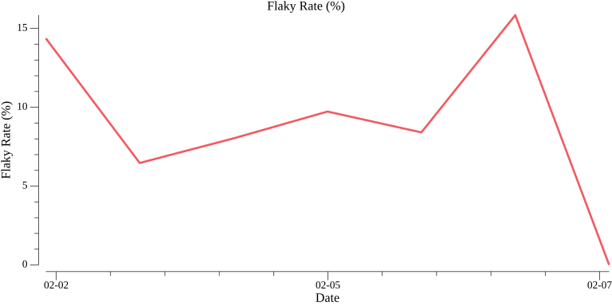
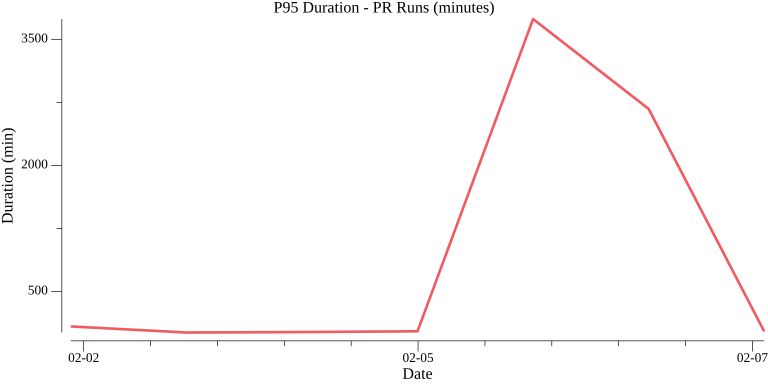
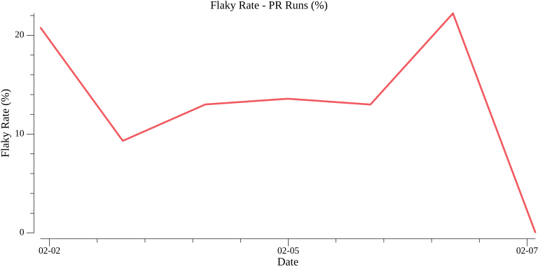

# Week 6 of 2026

**Period:** 2026-02-02 to 2026-02-08
**Generated:** 2026-02-12 18:19:37

## Summary

- **Total runs**: 3249
- **Success rate**: 62.9%
- **Flaky rate**: 9.6%
- **Average duration**: 92.3 min
- **P95 duration**: 22.9 min

## End-User Experience (Pull Request Runs)

Metrics for PR-triggered workflow runs - this represents the experience developers have when submitting pull requests.

- **PR-triggered runs**: 1704 (52.4% of total)
- **Success rate**: 63.0%
- **Flaky rate**: 14.7%
- **Average duration**: 171.9 min
- **P95 duration**: 27.8 min

## Daily Trends

### Overall Metrics (All Runs)

#### P95 Latency Over Time (minutes)

#### Flaky Rate Over Time (%)

### End-User Experience (PR-Triggered Runs)

#### P95 Latency Over Time - PR Runs (minutes)

#### Flaky Rate Over Time - PR Runs (%)

## Per-Workflow Analysis

Breakdown by individual workflow to identify improvement opportunities.

### Top 10 Workflows by Run Count

| Rank | Workflow | Total Runs | Success Rate | Flaky Rate | Avg Duration (min) | P95 Duration (min) |
|------|----------|------------|--------------|------------|--------------------|--------------------|
| 1 | Retry workflow | 534 | 24.7% | 0.0% | 0.2 | 0.2 |
| 2 | check-milestone-label | 322 | 34.2% | 13.4% | 160.0 | 20.8 |
| 3 | Issue and PR comment commands | 242 | 99.6% | 0.0% | 0.3 | 0.6 |
| 4 | Tests | 232 | 70.7% | 8.2% | 123.6 | 15.8 |
| 5 | Conformance tests | 232 | 66.8% | 40.9% | 127.0 | 72.5 |
| 6 | Build images | 203 | 75.9% | 8.9% | 133.8 | 14.1 |
| 7 | Build devcontainer | 203 | 77.8% | 19.7% | 133.6 | 16.2 |
| 8 | Check actions | 203 | 91.6% | 8.9% | 129.8 | 9.1 |
| 9 | Verify codegen | 203 | 69.5% | 8.9% | 137.6 | 15.1 |
| 10 | Lint | 203 | 70.4% | 8.9% | 134.6 | 15.0 |

## Daily Breakdown

| Date | Total Runs | Success Rate | Flaky Rate | Avg Duration (min) | P95 Duration (min) |
|------|------------|--------------|------------|--------------------|--------------------|
| 2026-02-02 | 647 | 53.9% | 14.4% | 21.2 | 28.2 |
| 2026-02-03 | 572 | 60.1% | 6.5% | 5.4 | 18.7 |
| 2026-02-04 | 685 | 69.5% | 8.0% | 135.7 | 21.4 |
| 2026-02-05 | 555 | 62.7% | 9.7% | 132.2 | 21.6 |
| 2026-02-06 | 666 | 65.2% | 8.4% | 126.7 | 22.5 |
| 2026-02-07 | 101 | 72.3% | 15.8% | 319.7 | 2668.8 |
| 2026-02-08 | 23 | 87.0% | 0.0% | 4.5 | 23.2 |

## Top 5 Most Flaky Workflows

1. **Conformance tests** - 40.9% flaky (232 runs)
2. **Build devcontainer** - 19.7% flaky (203 runs)
3. **check-milestone-label** - 13.4% flaky (322 runs)
4. **helm-test** - 12.9% flaky (85 runs)
5. **Lint** - 8.9% flaky (203 runs)

## Top 5 Slowest Workflows (P95)

1. **Conformance tests** - 72.5 min P95 (232 runs)
2. **Load Tests** - 28.8 min P95 (157 runs)
3. **Publish images** - 24.8 min P95 (29 runs)
4. **check-milestone-label** - 20.8 min P95 (322 runs)
5. **helm-test** - 18.0 min P95 (85 runs)
