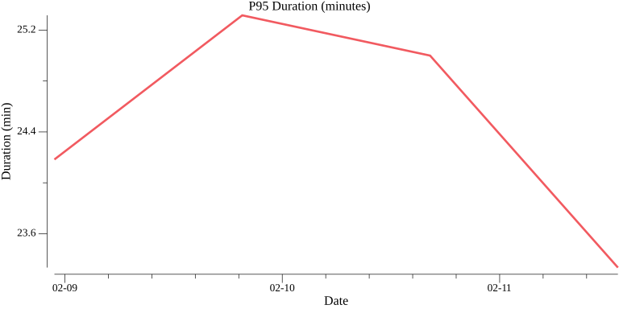
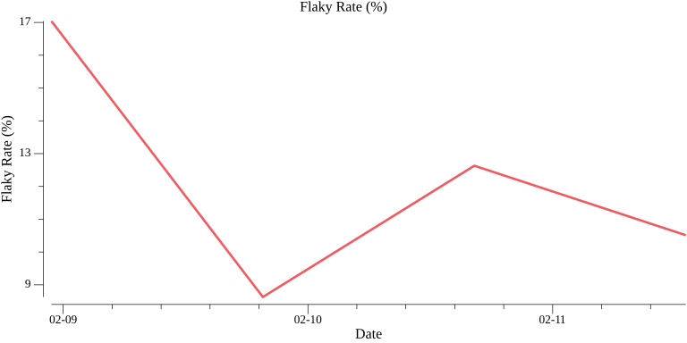
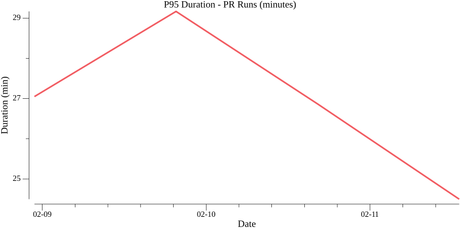
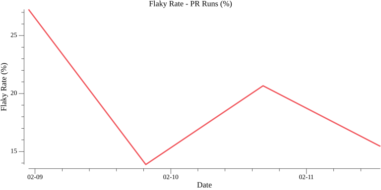

# Week 7 of 2026

**Period:** 2026-02-09 to 2026-02-15
**Generated:** 2026-02-12 18:19:37

## Summary

- **Total runs**: 6891
- **Success rate**: 68.7%
- **Flaky rate**: 12.8%
- **Average duration**: 12.2 min
- **P95 duration**: 24.4 min

## End-User Experience (Pull Request Runs)

Metrics for PR-triggered workflow runs - this represents the experience developers have when submitting pull requests.

- **PR-triggered runs**: 4234 (61.4% of total)
- **Success rate**: 73.5%
- **Flaky rate**: 20.2%
- **Average duration**: 17.7 min
- **P95 duration**: 26.2 min

## Daily Trends

### Overall Metrics (All Runs)

#### P95 Latency Over Time (minutes)

#### Flaky Rate Over Time (%)

### End-User Experience (PR-Triggered Runs)

#### P95 Latency Over Time - PR Runs (minutes)

#### Flaky Rate Over Time - PR Runs (%)

## Per-Workflow Analysis

Breakdown by individual workflow to identify improvement opportunities.

### Top 10 Workflows by Run Count

| Rank | Workflow | Total Runs | Success Rate | Flaky Rate | Avg Duration (min) | P95 Duration (min) |
|------|----------|------------|--------------|------------|--------------------|--------------------|
| 1 | Retry workflow | 1146 | 26.9% | 0.0% | 0.2 | 0.4 |
| 2 | Issue and PR comment commands | 696 | 99.9% | 0.0% | 0.7 | 4.2 |
| 3 | check-milestone-label | 601 | 64.4% | 16.8% | 10.8 | 8.6 |
| 4 | Conformance tests | 479 | 52.8% | 51.6% | 28.1 | 51.1 |
| 5 | Tests | 479 | 71.8% | 13.8% | 20.7 | 26.8 |
| 6 | Lint | 380 | 75.5% | 16.3% | 17.4 | 12.3 |
| 7 | Verify codegen | 380 | 68.4% | 16.3% | 21.6 | 27.3 |
| 8 | Check actions | 380 | 94.5% | 16.3% | 12.1 | 6.9 |
| 9 | Build devcontainer | 380 | 83.2% | 24.5% | 16.4 | 15.1 |
| 10 | cli | 380 | 78.9% | 16.3% | 18.7 | 14.1 |

## Daily Breakdown

| Date | Total Runs | Success Rate | Flaky Rate | Avg Duration (min) | P95 Duration (min) |
|------|------------|--------------|------------|--------------------|--------------------|
| 2026-02-09 | 2418 | 70.4% | 17.0% | 23.2 | 24.2 |
| 2026-02-10 | 1356 | 70.0% | 8.6% | 6.6 | 25.3 |
| 2026-02-11 | 1148 | 65.1% | 12.6% | 6.3 | 25.0 |
| 2026-02-12 | 1969 | 67.7% | 10.5% | 5.7 | 23.3 |

## Top 5 Most Flaky Workflows

1. **Conformance tests** - 51.6% flaky (479 runs)
2. **helm-test** - 43.8% flaky (73 runs)
3. **Build devcontainer** - 24.5% flaky (380 runs)
4. **check-milestone-label** - 16.8% flaky (601 runs)
5. **Verify codegen** - 16.3% flaky (380 runs)

## Top 5 Slowest Workflows (P95)

1. **Conformance tests** - 51.1 min P95 (479 runs)
2. **Load Tests** - 45.2 min P95 (292 runs)
3. **Verify codegen** - 27.3 min P95 (380 runs)
4. **Tests** - 26.8 min P95 (479 runs)
5. **Publish images** - 24.8 min P95 (99 runs)
